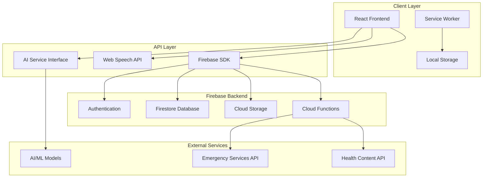

# Design Document: LifeGuard AI Health Application

## Overview

LifeGuard AI is a React-based health companion application designed specifically for rural Indian populations. The system leverages Firebase as a serverless backend, integrates AI-powered symptom analysis, and provides multilingual support to bridge healthcare gaps in underserved communities. The architecture emphasizes offline-first functionality, cultural sensitivity, and accessibility to ensure effective healthcare delivery in resource-constrained environments.

The application follows a modular, component-based architecture that separates concerns between presentation, business logic, and data management layers. This design enables scalability, maintainability, and the ability to adapt to varying network conditions common in rural areas.

## Architecture

### High-Level Architecture



### System Architecture Patterns

**Offline-First Architecture**: The application implements an offline-first approach using Firebase's built-in offline persistence combined with service workers for caching critical resources. This ensures core functionality remains available during network interruptions.

**Event-Driven Architecture**: The system uses Firebase's real-time listeners and React's state management to create an event-driven architecture that responds to data changes, user interactions, and system events.

**Microservices Pattern**: Firebase Cloud Functions provide serverless microservices for AI processing, data validation, and integration with external health services.

## Components and Interfaces

### Core Components

#### Authentication Module
- **AuthProvider**: React context provider managing user authentication state
- **LoginComponent**: Handles user login with email/password and social authentication
- **SignupComponent**: Manages user registration with health profile initialization
- **PasswordResetComponent**: Provides secure password recovery functionality

**Interface**: 
```typescript
interface AuthService {
  login(email: string, password: string): Promise<User>
  signup(userData: UserRegistration): Promise<User>
  logout(): Promise<void>
  resetPassword(email: string): Promise<void>
  getCurrentUser(): User | null
}
```

#### Dashboard Module
- **HealthDashboard**: Main dashboard displaying health overview and metrics
- **HealthTreeComponent**: Gamified visualization of user health progress
- **MetricsDisplay**: Charts and graphs showing health trends using Recharts
- **QuickActions**: Shortcuts to frequently used features

**Interface**:
```typescript
interface DashboardService {
  getHealthSummary(userId: string): Promise<HealthSummary>
  updateHealthTree(userId: string, points: number): Promise<TreeStatus>
  getRecentMetrics(userId: string, timeframe: string): Promise<HealthMetric[]>
}
```

#### Symptom Analysis Module
- **VoiceInputComponent**: Web Speech API integration for voice symptom capture
- **SymptomForm**: Text-based symptom entry with structured data collection
- **AIAnalysisEngine**: Processes symptoms and provides health recommendations
- **ResultsDisplay**: Presents AI analysis results with actionable guidance

**Interface**:
```typescript
interface SymptomAnalyzer {
  analyzeSymptoms(symptoms: SymptomData): Promise<AnalysisResult>
  processVoiceInput(audioData: Blob): Promise<string>
  getRecommendations(analysis: AnalysisResult): Promise<Recommendation[]>
}
```

#### Medical Wallet Module
- **DocumentUpload**: Secure file upload with validation and encryption
- **DocumentViewer**: Display and organize medical records
- **ShareManager**: Generate secure sharing links for healthcare providers
- **CategoryManager**: Automatic document categorization and tagging

**Interface**:
```typescript
interface MedicalWallet {
  uploadDocument(file: File, metadata: DocumentMetadata): Promise<Document>
  getDocuments(userId: string, filters?: DocumentFilter): Promise<Document[]>
  shareDocument(documentId: string, permissions: SharePermissions): Promise<ShareLink>
  deleteDocument(documentId: string): Promise<void>
}
```

#### Reminder System Module
- **ReminderScheduler**: Creates and manages medication and appointment reminders
- **NotificationManager**: Handles push notifications and sound alerts
- **AdherenceTracker**: Monitors medication compliance and generates reports
- **ReminderSettings**: User preferences for notification timing and methods

**Interface**:
```typescript
interface ReminderService {
  createReminder(reminder: ReminderData): Promise<Reminder>
  scheduleNotification(reminder: Reminder): Promise<void>
  markCompleted(reminderId: string): Promise<void>
  getAdherenceReport(userId: string, period: string): Promise<AdherenceReport>
}
```

#### Community Module
- **CommunityFeed**: Displays health discussions and support groups
- **PostManager**: Handles user posts with content moderation
- **GroupManager**: Manages health-focused discussion groups
- **ModerationEngine**: Automated content filtering and human moderation queue

**Interface**:
```typescript
interface CommunityService {
  getPosts(groupId?: string, filters?: PostFilter): Promise<Post[]>
  createPost(postData: PostData): Promise<Post>
  moderateContent(content: string): Promise<ModerationResult>
  joinGroup(userId: string, groupId: string): Promise<void>
}
```

### Cross-Cutting Components

#### Language Module
- **LanguageProvider**: React context for multilingual support
- **TranslationService**: Manages English and Hindi translations
- **LocaleManager**: Handles cultural formatting and preferences

#### Offline Sync Module
- **SyncManager**: Coordinates data synchronization between local and cloud storage
- **ConflictResolver**: Handles data conflicts during sync operations
- **CacheManager**: Manages local data caching and expiration

#### Security Module
- **EncryptionService**: Client-side encryption for sensitive health data
- **PermissionManager**: Role-based access control implementation
- **AuditLogger**: Tracks user actions for security and compliance

## Data Models

### User Data Model
```typescript
interface User {
  uid: string
  email: string
  profile: {
    name: string
    age: number
    gender: string
    location: {
      state: string
      district: string
      village?: string
    }
    preferredLanguage: 'en' | 'hi'
    emergencyContacts: EmergencyContact[]
  }
  healthProfile: {
    conditions: string[]
    allergies: string[]
    medications: Medication[]
    bloodType?: string
  }
  preferences: {
    notifications: NotificationSettings
    privacy: PrivacySettings
    accessibility: AccessibilitySettings
  }
  createdAt: Timestamp
  lastActive: Timestamp
}
```

### Health Data Models
```typescript
interface HealthMetric {
  id: string
  userId: string
  type: 'weight' | 'blood_pressure' | 'blood_sugar' | 'temperature' | 'heart_rate'
  value: number | { systolic: number, diastolic: number }
  unit: string
  timestamp: Timestamp
  notes?: string
}

interface SymptomEntry {
  id: string
  userId: string
  symptoms: {
    description: string
    severity: 1 | 2 | 3 | 4 | 5
    duration: string
    bodyPart?: string
  }[]
  inputMethod: 'voice' | 'text'
  language: 'en' | 'hi'
  timestamp: Timestamp
  analysis?: AnalysisResult
}

interface AnalysisResult {
  id: string
  confidence: number
  possibleConditions: {
    name: string
    probability: number
    severity: 'low' | 'medium' | 'high' | 'emergency'
  }[]
  recommendations: {
    type: 'self_care' | 'consult_doctor' | 'emergency' | 'lifestyle'
    description: string
    urgency: 'immediate' | 'within_24h' | 'within_week' | 'routine'
  }[]
  disclaimer: string
  timestamp: Timestamp
}
```

### Document and Reminder Models
```typescript
interface MedicalDocument {
  id: string
  userId: string
  filename: string
  type: 'prescription' | 'test_result' | 'consultation' | 'insurance' | 'other'
  category: string
  uploadDate: Timestamp
  fileUrl: string
  thumbnailUrl?: string
  metadata: {
    doctorName?: string
    hospitalName?: string
    date?: Timestamp
    tags: string[]
  }
  shareLinks: ShareLink[]
  encrypted: boolean
}

interface Reminder {
  id: string
  userId: string
  type: 'medication' | 'appointment' | 'health_check'
  title: string
  description: string
  schedule: {
    frequency: 'once' | 'daily' | 'weekly' | 'monthly' | 'custom'
    times: string[] // HH:MM format
    startDate: Timestamp
    endDate?: Timestamp
  }
  medication?: {
    name: string
    dosage: string
    instructions: string
  }
  appointment?: {
    doctorName: string
    location: string
    phone?: string
  }
  notifications: {
    sound: boolean
    vibration: boolean
    soundFile?: string
  }
  adherence: AdherenceRecord[]
  active: boolean
}
```

### Community and Gamification Models
```typescript
interface CommunityPost {
  id: string
  authorId: string
  authorName: string
  content: string
  groupId?: string
  tags: string[]
  timestamp: Timestamp
  moderated: boolean
  moderationStatus: 'approved' | 'pending' | 'rejected'
  likes: number
  replies: Reply[]
  anonymous: boolean
}

interface HealthTree {
  userId: string
  level: number
  totalPoints: number
  currentLevelPoints: number
  pointsToNextLevel: number
  achievements: Achievement[]
  streaks: {
    medicationAdherence: number
    dailyCheckIn: number
    healthTips: number
  }
  treeType: 'banyan' | 'neem' | 'mango' | 'peepal'
  lastUpdated: Timestamp
}
```

### Firebase Collections Structure
```
users/{userId}
healthMetrics/{userId}/metrics/{metricId}
symptoms/{userId}/entries/{entryId}
documents/{userId}/files/{documentId}
reminders/{userId}/reminders/{reminderId}
community/posts/{postId}
community/groups/{groupId}
healthTrees/{userId}
healthTips/{tipId}
emergencyContacts/{contactId}
```

## Correctness Properties

*A property is a characteristic or behavior that should hold true across all valid executions of a system—essentially, a formal statement about what the system should do. Properties serve as the bridge between human-readable specifications and machine-verifiable correctness guarantees.*

Before defining the correctness properties, I need to analyze the acceptance criteria from the requirements to determine which ones are testable as properties.

Based on the prework analysis, I can now define the consolidated correctness properties:

### Property 1: Authentication and Account Management
*For any* valid user registration data, the system should successfully create a Firebase account, initialize a Health_Tree with zero progress, and enforce password complexity requirements
**Validates: Requirements 1.1, 1.2, 1.5, 1.6**

### Property 2: Authentication Security and Recovery
*For any* authentication attempt, the system should properly validate credentials, reject invalid attempts with appropriate errors, and provide secure password recovery for valid email addresses
**Validates: Requirements 1.2, 1.3, 1.4**

### Property 3: Multilingual Interface Consistency
*For any* user interface element, the system should display content in the user's selected language (English or Hindi) and immediately update when language preferences change
**Validates: Requirements 2.1, 2.3, 2.5**

### Property 4: Language Preference Persistence
*For any* language selection, the system should persist the preference across sessions and apply it to all voice interactions and content display
**Validates: Requirements 2.2, 2.4**

### Property 5: Dashboard Health Overview
*For any* dashboard access, the system should display current Health_Tree status, recent metrics, upcoming reminders, and highlight pending health actions
**Validates: Requirements 3.1, 3.3, 3.5**

### Property 6: Health Progress Tracking
*For any* health-related activity completion, the system should update Health_Tree progress, display achievement notifications, and refresh visualizations within 2 seconds
**Validates: Requirements 3.2, 3.4**

### Property 7: Voice Input Processing
*For any* voice input activation, the system should capture speech using Web Speech API in the user's language, provide text alternatives when unavailable, and support accent recognition
**Validates: Requirements 4.1, 4.3, 4.4**

### Property 8: AI Symptom Analysis
*For any* symptom data collection, the system should process information through the AI analyzer, provide health predictions, present results in accessible formats, and trigger emergency recommendations for serious concerns
**Validates: Requirements 4.2, 4.5, 4.6**

### Property 9: Medication Reminder Management
*For any* medication reminder setup, the system should schedule notifications with customizable alerts, display complete medication details when triggered, and allow configuration of preferences
**Validates: Requirements 5.1, 5.2, 5.5, 5.6**

### Property 10: Medication Adherence Tracking
*For any* medication interaction (acknowledgment or missed dose), the system should record adherence data, update Health_Tree progress, and send appropriate follow-up notifications
**Validates: Requirements 5.3, 5.4**

### Property 11: Secure Document Storage
*For any* medical document upload, the system should store files securely using Firebase Storage with encryption, support common formats (PDF, JPEG, PNG), and automatically categorize documents
**Validates: Requirements 6.1, 6.2, 6.5**

### Property 12: Document Management and Sharing
*For any* document operation (search, share, storage management), the system should provide filtering options, generate secure time-limited sharing links, and notify users when storage limits are approached
**Validates: Requirements 6.3, 6.4, 6.6**

### Property 13: Community Platform Access
*For any* community interaction, the system should display relevant discussions, allow group joining, protect user privacy through anonymous participation, and provide medical disclaimers
**Validates: Requirements 7.1, 7.3, 7.5, 7.6**

### Property 14: Content Moderation and Safety
*For any* community post, the system should moderate content for appropriateness and medical accuracy, remove inappropriate content, and notify moderators
**Validates: Requirements 7.2, 7.4**

### Property 15: Health Content Delivery
*For any* health content access, the system should provide curated, medically reviewed, culturally appropriate content in the user's preferred language with proper cultural context
**Validates: Requirements 8.1, 8.2, 8.5**

### Property 16: Personalized Content Recommendations
*For any* health tip reading, the system should track engagement and suggest related content based on the user's health profile
**Validates: Requirements 8.3**

### Property 17: Health Data Storage and Visualization
*For any* health metric entry, the system should store data with timestamps, validate against reasonable ranges, provide trend visualization using Recharts, and support common health indicators
**Validates: Requirements 9.1, 9.2, 9.5**

### Property 18: Health Pattern Analysis and Reporting
*For any* health data analysis, the system should detect concerning patterns, alert users with medical consultation suggestions, and generate exportable reports suitable for healthcare providers
**Validates: Requirements 9.3, 9.4**

### Property 19: Offline Functionality and Caching
*For any* connectivity loss, the system should provide access to cached health data, maintain basic functionality, cache essential information, and queue user actions for later sync
**Validates: Requirements 10.1, 10.3, 10.4**

### Property 20: Data Synchronization and Conflict Resolution
*For any* connectivity restoration, the system should automatically synchronize offline changes and prioritize user safety when resolving sync conflicts
**Validates: Requirements 10.2, 10.5**

### Property 21: Comprehensive Data Security
*For any* health data operation, the system should encrypt data in transit and at rest, require authentication for sensitive access, implement role-based access controls, and ensure users can only access their own data
**Validates: Requirements 11.1, 11.2, 11.5**

### Property 22: Privacy and Compliance Management
*For any* privacy-related operation, the system should provide data control options, respond to breach detection with immediate notifications, and permanently delete user data within 30 days of deletion requests
**Validates: Requirements 11.3, 11.4, 11.6**

### Property 23: Performance and Responsiveness
*For any* user interaction, the system should load the dashboard within 3 seconds on 3G, provide immediate visual feedback, complete actions within 2 seconds, and optimize for poor network conditions
**Validates: Requirements 12.1, 12.2, 12.4**

### Property 24: Accessibility and Responsive Design
*For any* device or accessibility need, the system should support screen readers, high contrast mode, large text options, maintain responsive design from 320px to 1920px width, and provide user-friendly error messages with recovery options
**Validates: Requirements 12.3, 12.5, 12.6**

### Property 25: Emergency Feature Availability
*For any* emergency situation, the system should provide prominent emergency contact buttons, display critical health information when emergency mode is activated, allow emergency contact configuration, and maintain functionality even when other components are unavailable
**Validates: Requirements 13.1, 13.2, 13.3, 13.5**

### Property 26: Emergency Response Prioritization
*For any* severe symptom report, the system should prioritize emergency guidance over general health recommendations
**Validates: Requirements 13.4**

### Property 27: Health Data Interoperability
*For any* data export or integration, the system should generate reports in standard formats compatible with EHR systems, provide APIs for authorized healthcare providers, support common device protocols, and maintain data format consistency
**Validates: Requirements 14.1, 14.2, 14.3, 14.4**

### Property 28: Integration Privacy and Compliance
*For any* third-party integration, the system should ensure all data sharing complies with privacy regulations and user consent requirements
**Validates: Requirements 14.5**

## Error Handling

The LifeGuard AI system implements comprehensive error handling strategies to ensure reliability and user safety, particularly important in healthcare applications serving rural populations with varying connectivity.

### Error Categories and Handling Strategies

#### Network and Connectivity Errors
- **Offline Mode Activation**: When network connectivity is lost, the system automatically switches to offline mode, displaying cached content and queuing user actions
- **Graceful Degradation**: Features are prioritized by criticality, with emergency functions remaining available even when other services fail
- **Retry Mechanisms**: Automatic retry with exponential backoff for transient network failures
- **User Feedback**: Clear indicators showing offline status and sync progress

#### Authentication and Security Errors
- **Session Management**: Automatic token refresh with fallback to re-authentication when necessary
- **Security Violations**: Immediate session termination and audit logging for suspicious activities
- **Rate Limiting**: Protection against brute force attacks with progressive delays
- **Data Integrity**: Validation of all user inputs with sanitization to prevent injection attacks

#### AI and Voice Processing Errors
- **Voice Recognition Fallbacks**: Alternative text input when speech recognition fails or is unavailable
- **AI Service Failures**: Cached responses for common symptoms when AI services are unreachable
- **Confidence Thresholds**: Clear indication when AI confidence is low, with recommendations for human consultation
- **Language Processing**: Fallback to English when Hindi processing encounters errors

#### Data Storage and Sync Errors
- **Conflict Resolution**: Timestamp-based conflict resolution prioritizing user safety and recent health-critical data
- **Storage Limits**: Proactive notifications and cleanup suggestions when approaching storage quotas
- **Backup Strategies**: Multiple redundancy levels for critical health data
- **Data Validation**: Server-side validation with client-side pre-validation for immediate feedback

#### Emergency and Critical Path Errors
- **Emergency Service Availability**: Multiple fallback emergency contact methods when primary services fail
- **Critical Data Access**: Guaranteed access to emergency health information even during system failures
- **Medication Reminders**: Local notification backup when cloud services are unavailable
- **Health Alert Escalation**: Progressive escalation when initial alert delivery fails

### Error Recovery Patterns

#### User-Initiated Recovery
- **Manual Sync**: User-triggered synchronization when automatic sync fails
- **Cache Refresh**: Option to clear and rebuild local cache when data appears stale
- **Alternative Workflows**: Multiple paths to accomplish critical tasks

#### Automatic Recovery
- **Background Sync**: Continuous background synchronization when connectivity is restored
- **Health Checks**: Regular system health monitoring with automatic remediation
- **Progressive Enhancement**: Gradual restoration of features as services become available

## Testing Strategy

The LifeGuard AI testing strategy employs a dual approach combining comprehensive unit testing with property-based testing to ensure reliability, safety, and correctness across all system components.

### Dual Testing Approach

**Unit Testing Focus:**
- Specific examples demonstrating correct behavior for critical health scenarios
- Integration points between React components and Firebase services
- Edge cases in health data validation and emergency detection
- Error conditions and recovery mechanisms
- Cultural and linguistic accuracy in multilingual content

**Property-Based Testing Focus:**
- Universal properties that must hold across all user inputs and system states
- Comprehensive input coverage through randomized test generation
- Invariant preservation during data transformations and sync operations
- Security and privacy properties across all user interactions
- Performance characteristics under varying network conditions

### Property-Based Testing Configuration

**Testing Framework:** Fast-check for JavaScript/TypeScript property-based testing
**Minimum Iterations:** 100 iterations per property test to ensure statistical confidence
**Test Tagging:** Each property test references its corresponding design document property

**Tag Format:** `Feature: lifeguard-ai-health-app, Property {number}: {property_text}`

### Testing Categories

#### Authentication and Security Testing
- **Unit Tests:** Specific login scenarios, password validation edge cases, session timeout handling
- **Property Tests:** Authentication round-trip consistency, security policy enforcement across all user types

#### Health Data Integrity Testing  
- **Unit Tests:** Specific medical record formats, known symptom-diagnosis pairs, emergency threshold values
- **Property Tests:** Data validation across all health metrics, encryption/decryption round-trip properties

#### Multilingual and Accessibility Testing
- **Unit Tests:** Specific translation accuracy, cultural appropriateness of health content
- **Property Tests:** UI consistency across language switches, accessibility compliance for all interface elements

#### Offline Functionality Testing
- **Unit Tests:** Specific sync conflict scenarios, known network failure patterns
- **Property Tests:** Data consistency during offline/online transitions, queue integrity across all user actions

#### AI and Voice Processing Testing
- **Unit Tests:** Known symptom patterns, specific voice recognition scenarios, emergency detection cases
- **Property Tests:** AI response consistency, voice processing accuracy across accent variations

#### Performance and Reliability Testing
- **Unit Tests:** Specific load scenarios, known performance bottlenecks
- **Property Tests:** Response time consistency across all user interactions, resource usage patterns

### Test Environment Configuration

**Development Environment:**
- Firebase Emulator Suite for backend service testing
- Mock AI services for consistent symptom analysis testing
- Simulated network conditions for offline testing

**Staging Environment:**
- Real Firebase services with test data
- Limited AI service integration for end-to-end validation
- Performance monitoring and load testing

**Production Monitoring:**
- Real-time error tracking and performance monitoring
- User feedback integration for continuous improvement
- A/B testing for feature optimization

### Compliance and Regulatory Testing

**Healthcare Compliance:**
- HIPAA-equivalent privacy protection validation
- Medical content accuracy verification
- Emergency response system reliability testing

**Accessibility Compliance:**
- WCAG 2.1 AA compliance verification
- Screen reader compatibility testing
- Multi-device responsive design validation

**Cultural Sensitivity Testing:**
- Rural Indian healthcare context validation
- Hindi language accuracy and cultural appropriateness
- Community feature moderation effectiveness

The testing strategy ensures that LifeGuard AI maintains the highest standards of reliability, safety, and user experience while serving the critical healthcare needs of rural Indian populations.